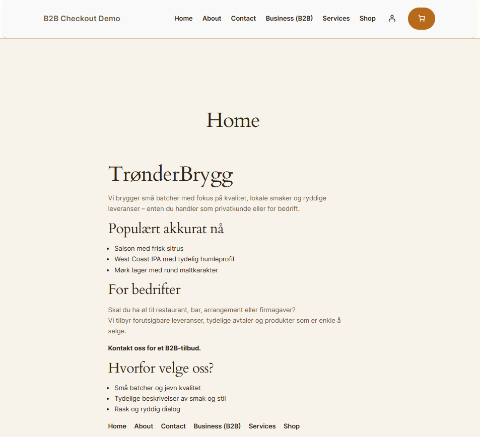
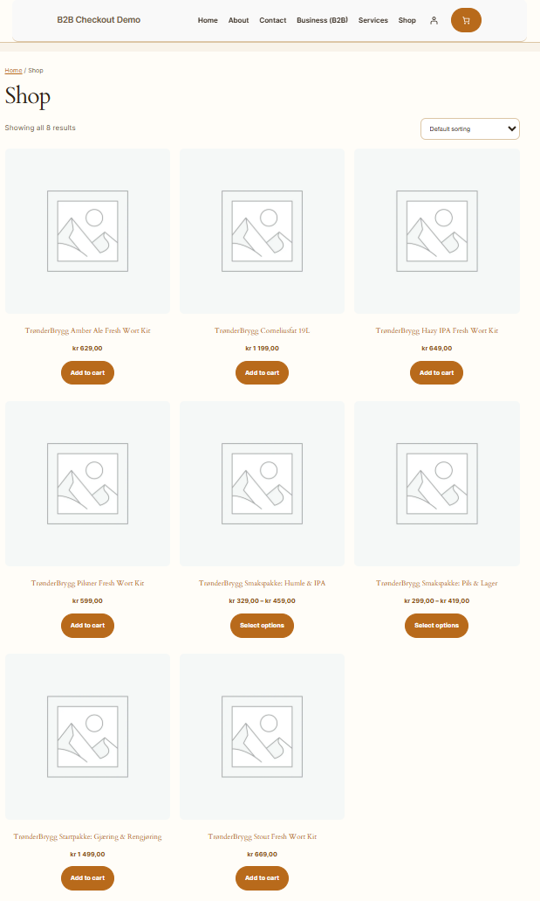
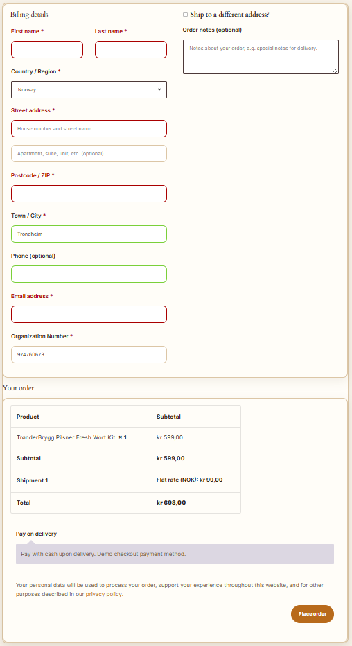
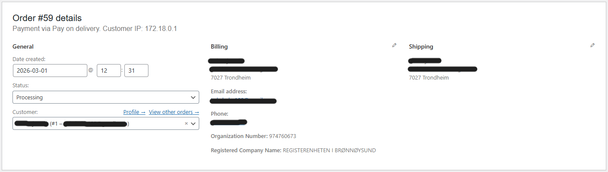

# B2B Checkout Demo

A local WordPress + WooCommerce demo built as a junior web developer case project.

## What this project includes

* WordPress running locally with Docker Compose
* WooCommerce store setup with demo products
* Child theme with a cleaner visual baseline
* Custom plugin that adds an **Organization Number** field to checkout
* Validation for 9-digit organization numbers
* Company lookup against the Norwegian Enhetsregisteret API
* Company name stored on the WooCommerce order
* Simple transient caching for lookup results

## Tech stack

* WordPress
* WooCommerce
* PHP
* MySQL / MariaDB
* Docker Compose
* HTML / CSS
* Enhetsregisteret API

## Project structure

* `docker-compose.yml` — local WordPress + database setup
* `wp/` — WordPress runtime files
* `theme/b2b-child-theme/` — child theme
* `plugin/b2b-checkout-tools/` — custom WooCommerce plugin
* `docs/` — scope and support notes

## Local setup

1. Start the local Docker setup from the project root
2. Open `http://localhost:8080`
3. Complete the WordPress setup in the browser and create your own local admin user
4. Log in to WordPress admin
5. Make sure WooCommerce and the custom plugin are active

## How to test the checkout lookup

1. Add any product to cart
2. Go to checkout
3. Enter a valid 9-digit organization number
4. Use `974760673` as a test value
5. Place the order
6. Open the order in WordPress admin
7. Confirm Organization Number and Registered Company Name appear on the order

## Notes

* The checkout page uses the classic WooCommerce checkout flow so the custom checkout field hooks work correctly
* This is an MVP case project, so the focus is practical scope

## Screenshots

### Homepage

### Shop

### Checkout

### Admin order view

## Next improvements

* Clean up a few remaining WooCommerce button styles
* Add AJAX-based company lookup/autofill in checkout for a smoother UX
* Do one final content and spacing pass across the main pages